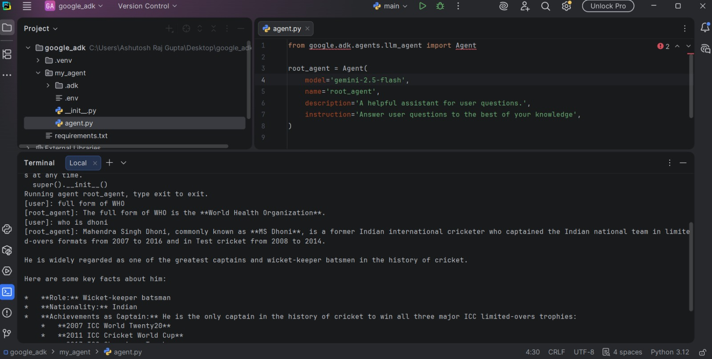
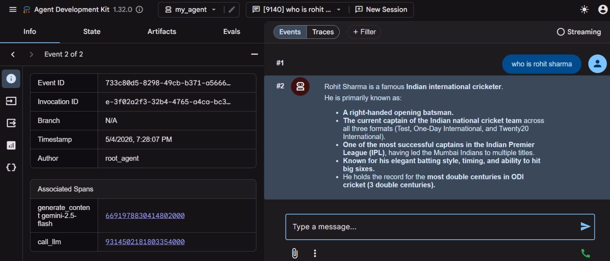
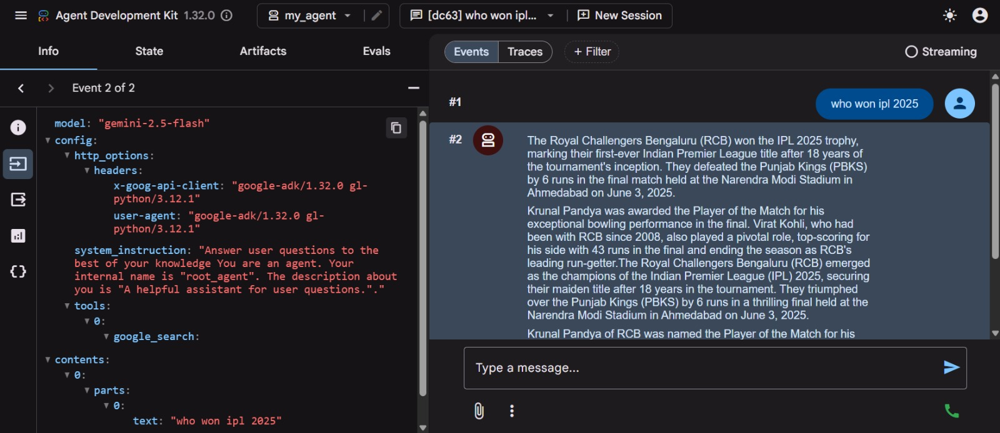
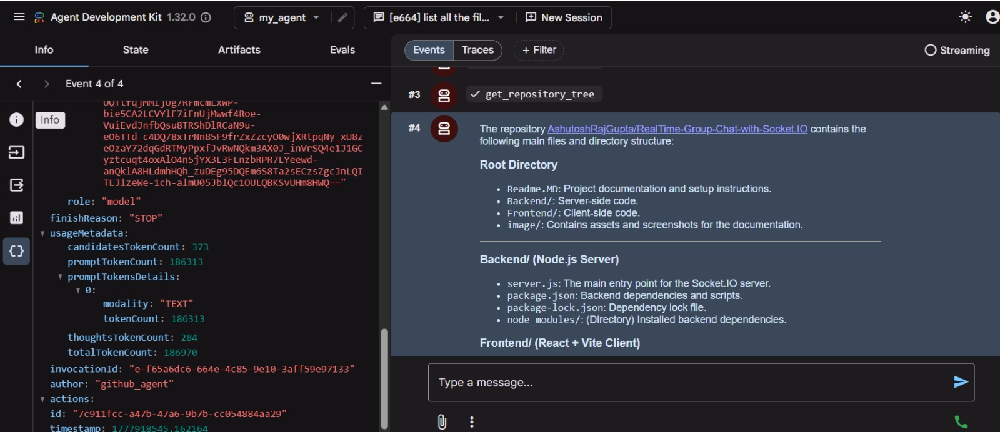

# 🤖 Getting Started with Google ADK (Agent Development Kit)

> A beginner-friendly guide to building **production-ready AI agents** using Google's open-source Agent Development Kit — based on the full tutorial walkthrough.

---

## 📖 Table of Contents

- [What is Google ADK?](#what-is-google-adk)
- [Why Learn ADK?](#why-learn-adk)
- [Prerequisites](#prerequisites)
- [Setup & Installation](#setup--installation)
- [Creating Your First Agent](#creating-your-first-agent)
- [Running the Agent](#running-the-agent)
- [Web Interface (Dev UI)](#web-interface-dev-ui)
- [Understanding Memory & Sessions](#understanding-memory--sessions)
- [Adding Tools to Your Agent](#adding-tools-to-your-agent)
- [Built-in Tools](#built-in-tools)
- [MCP Tools (GitHub Example)](#mcp-tools-github-example)
- [How Tool Calling Works](#how-tool-calling-works)


---

## 🧠 What is Google ADK?

**Google ADK (Agent Development Kit)** is an open-source framework for building, debugging, and deploying reliable AI agents at **enterprise scale**.

> *"Prototypes was so 2024. Now the goal should be production-ready agents."*

| Feature | Details |
|---|---|
| 🌍 Language Support | Python, TypeScript, Go, Java |
| 🎯 Focus | Production-grade agents |
| 🛠️ Built-in tooling | Dev UI, tracing, token tracking |
| 🤝 MCP Support | Plug-and-play external tool servers |

---

## 🚀 Why Learn ADK?

- Build **production-ready** agents (not just prototypes)
- Clean **multi-agent workflow** support
- Excellent **developer tooling** — built-in web UI, event tracing, token counters
- Strong **MCP (Model Context Protocol)** integration
- Backed by Google and actively maintained

---

## ✅ Prerequisites

- Python 3.10+
- A **Google AI API Key** → [Get one here](https://aistudio.google.com/app/apikey)
- Basic Python knowledge
- *(Optional)* GitHub Personal Access Token (for MCP GitHub example)

---

## ⚙️ Setup & Installation

> **`~0:00 – 5:00`** — Setting up the environment

### 1. Create & Activate a Virtual Environment

```bash
# Create virtual environment
python -m venv venv

# Activate (Mac/Linux)
source venv/bin/activate

# Activate (Windows)
venv\Scripts\activate
```

### 2. Install Google ADK

Create a `requirements.txt`:

```
google-adk
```

Then install:

```bash
pip install -r requirements.txt
```

---

## 🏗️ Creating Your First Agent

> **`~5:00 – 10:00`** — Scaffolding an agent project

Run the ADK create command:

```bash
adk create my_agent
```

During setup you'll be prompted to:
- Select a **model** → choose `Gemini 2.5 Flash`
- Choose a **provider** → select `Google AI`
- Paste your **API key**

This generates the following structure:

```
my_agent/
├── __init__.py
├── .env              ← Your API key lives here
└── agent.py          ← Root agent definition
```

### Default `agent.py` structure

```python
from google.adk.agents import Agent

root_agent = Agent(
    name="my_agent",
    model="gemini-2.5-flash",
    description="You are a helpful assistant for user questions.",
    instruction="Answer user questions to the best of your knowledge.",
    tools=[]
)
```

> 💡 **Tip:** The `instruction` field is very powerful. You can completely change agent behavior here — e.g., *"You are a witty pirate"*, *"Respond only in JSON"*, *"You are a senior software engineer"*.

---

## ▶️ Running the Agent

> **`~10:00 – 14:00`** — CLI interaction

```bash
adk run my_agent
```

Chat with your agent directly in the terminal. Type any message to start.

> ⚠️ **Free Tier Note:** You may occasionally hit rate limits with Gemini on the free tier. Wait ~5 minutes and try again — this is normal!

---

## 🌐 Web Interface (Dev UI)

> **`~14:00 – 20:00`** — Running the developer dashboard

```bash
adk web --port 8000
```

Then open `http://localhost:8000` in your browser.

The Dev UI gives you:

| Feature | Description |
|---|---|
| 💬 Chat Interface | Talk to your agent visually |
| 🔍 Trace Viewer | See every LLM call step-by-step |
| ⏱️ Timing Info | How long each step took |
| 🪙 Token Counter | Tokens used per call |
| 📊 Graph View | Visual flow of agent + tools |
| 📋 Event Log | Full request/response details |

> ⚠️ **Important:** The ADK Web UI is for **development only** — not for production use.

---

## 🧩 Understanding Memory & Sessions

> **`~17:00 – 22:00`** — How context and memory work

| Scope | Memory Behavior |
|---|---|
| **Within a session** | ✅ Agent remembers context (e.g., "when was she born?" after asking about Smriti Mandhana) |
| **New session** | ❌ Memory resets — agent has no context from previous sessions |
| **After restart** | ❌ All in-memory sessions are cleared |

> 💡 Memory is **in-memory and per-session** by default. Sessions can be managed in the Dev UI's Sessions panel.

---

## 🔧 Adding Tools to Your Agent

> **`~22:00 – 32:00`** — Why tools matter and how to add them

### Why Tools?

| LLM (alone) | Agent (LLM + Tools) |
|---|---|
| Answers questions | Can **take actions** |
| Has a knowledge cutoff | Can **search the web** |
| Cannot touch your files | Can **read/write files** |
| Cannot hit APIs | Can **call external services** |

### Writing a Custom Tool

Tools are just Python functions with clear docstrings:

```python
import os

def list_all_files() -> str:
    """Lists all the files and folders in the current directory."""
    items = os.listdir(".")
    result = []
    for item in items:
        if os.path.isdir(item):
            result.append(f"{item}/ (directory)")
        else:
            result.append(f"{item} (file)")
    return "\n".join(result)
```

> 💡 **The docstring IS the tool description.** The LLM reads it to decide when to call the tool. Make it clear and specific!

### Registering the Tool

```python
from google.adk.agents import Agent

root_agent = Agent(
    name="my_agent",
    model="gemini-2.5-flash",
    description="A helpful assistant.",
    instruction="Answer user questions to the best of your knowledge.",
    tools=[list_all_files]   # ← Add your tool here
)
```

---

## 🔌 Built-in Tools

> **`~32:00 – 38:00`** — Using ADK's pre-built tools

ADK ships with many built-in tools you can use out of the box:

```python
from google.adk.tools import google_search

root_agent = Agent(
    ...
    tools=[google_search]
)
```

**Example:** Without `google_search`, asking *"Who won IPL 2025?"* returns nothing (LLM has a knowledge cutoff). After adding it — the agent searches the web and returns the correct answer.

### Available Built-in Integrations

- 🔍 Google Search
- 🗄️ MongoDB
- 📝 Notion
- 🧠 Vertex AI RAG Engine (for building RAG pipelines)
- ...and many more — check the [ADK Tools docs](https://google.github.io/adk-docs/)

---

## 🛠️ MCP Tools (GitHub Example)

> **`~38:00 – 52:00`** — Integrating external MCP servers

**MCP (Model Context Protocol)** is a standard protocol for connecting agents to external tools exposed by third parties — without writing the integration yourself.

Examples of MCP servers:
- 🐙 GitHub
- 🗂️ Google Drive
- ☁️ AWS
- 📈 Zerodha
- ...hundreds more available

### GitHub MCP Integration

#### 1. Add your GitHub token to `.env`

```
GITHUB_TOKEN=your_personal_access_token_here
```

#### 2. Configure the MCP tool in `agent.py`

```python
import os
from dotenv import load_dotenv
from google.adk.agents import Agent
from google.adk.tools.mcp_tool.mcp_toolset import MCPToolset, StdioServerParameters

load_dotenv()

root_agent = Agent(
    name="my_agent",
    model="gemini-2.5-flash",
    description="A helpful assistant with GitHub access.",
    instruction="Answer user questions to the best of your knowledge.",
    tools=[
        MCPToolset(
            connection_params=StdioServerParameters(
                command="npx",
                args=["-y", "@modelcontextprotocol/server-github"],
                env={"GITHUB_PERSONAL_ACCESS_TOKEN": os.getenv("GITHUB_TOKEN")}
            )
        )
    ]
)
```

#### 3. Try it out

```
User: List all the files in this GitHub repo: https://github.com/your/repo
```

The agent will automatically pick the right tool (`get_repository_tree`) and return the file list.

---

## Screenshots
> 
> 
> 
> 

## 🔄 How Tool Calling Works

> **`~28:00 – 35:00`** — The full flow explained

```
User Query
    │
    ▼
LLM Call #1  ──► "You should call tool: list_all_files"
    │
    ▼
Tool Executes  ──► Returns result (e.g., file list)
    │
    ▼
LLM Call #2  ──► Frames a natural language response
    │
    ▼
Final Response to User
```

> You can observe this entire flow live in the **Dev UI trace viewer** — including exact request/response payloads, token counts, and timing for every step.

---


## 🤝 Contributing

Found an issue or want to improve the examples? PRs are welcome!

1. Fork this repo
2. Create your branch: `git checkout -b feature/my-improvement`
3. Commit your changes: `git commit -m 'Add some improvement'`
4. Push and open a PR

---

<div align="center">

Made with ❤️ | Follow along, build things, and share what you've created!

</div>